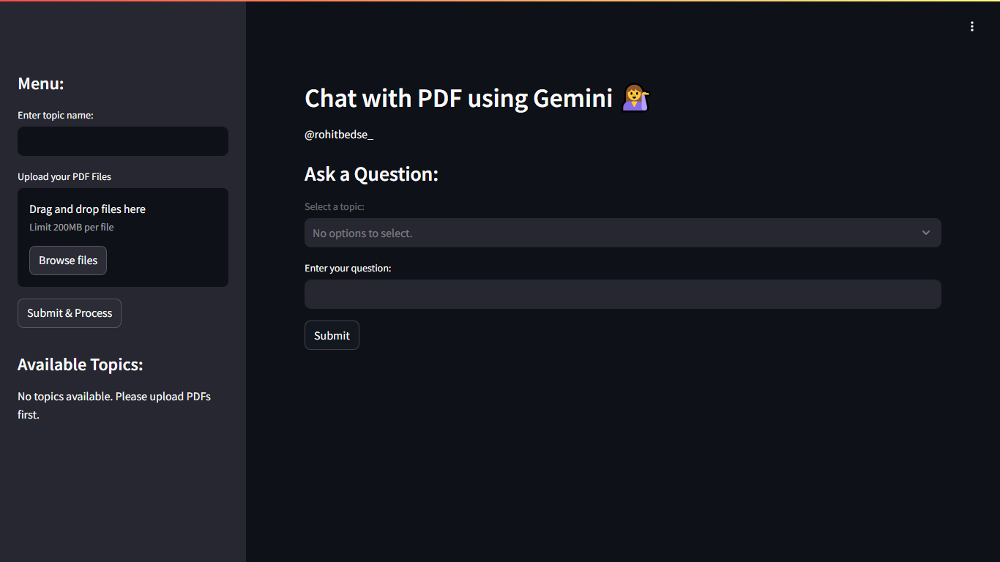

# 📄 Chat with PDF using Gemini & FAISS

An intelligent **PDF question-answering system** built with **LangChain**, **FAISS**, and **Gemini (Google Generative AI)**. Upload your PDFs, extract knowledge using embeddings, and ask questions with real-time semantic search.

> ⚡ Powered by: `GoogleGenerativeAI`, `FAISS`, `LangChain`, `Streamlit`

---

## 🔥 Features

* ✅ Upload multiple PDFs by topic
* ✅ Extract and chunk text with LangChain
* ✅ Generate embeddings with **Gemini’s Embedding API**
* ✅ Store and search using **FAISS (Facebook AI Similarity Search)**
* ✅ Ask questions and get context-aware answers via **Gemini LLM**
* ✅ Save & reuse vector stores for each topic
* ✅ Clean **Streamlit UI** for interaction

---

## 🧠 How It Works

```
PDF → Text Extraction → Chunking → Embedding → FAISS Index
             ↓                             ↑
          User Query → Embedding → Similarity Search → Gemini LLM (QA)
```

---

## 🚀 Demo



> Simple UI to upload files, select topics, and chat with knowledge stored in your PDFs.

---

## 📦 Installation

```bash
git clone https://github.com/yourusername/chat-with-pdf-faiss-gemini.git
cd chat-with-pdf-faiss-gemini
pip install -r requirements.txt
```

### 🧪 Required Packages

```bash
streamlit
PyPDF2
langchain
langchain-community
langchain-google-genai
python-dotenv
```

---

## 🔐 Setup

1. Create a `.env` file in the root directory:

```env
GOOGLE_API_KEY=your_google_genai_api_key
```

2. Make sure your Google Generative AI key has access to:

   * `models/embedding-001`
   * `gemini-1.5-flash-latest`

---

## 🧑‍💻 Usage

```bash
streamlit run app.py
```

### 🎯 Main Functions

* `get_pdf_text()` → Extracts text from uploaded PDFs.
* `get_text_chunks()` → Splits text into manageable chunks for embedding.
* `get_vector_store()` → Generates FAISS index from embeddings.
* `handle_user_input()` → Retrieves similar docs & gets response via Gemini.

---

## 🗂️ Project Structure

```
📁 chat-with-pdf-faiss-gemini/
│
├── 📄 app.py                   # Main Streamlit app
├── 📄 .env                     # API Key
├── 📁 faiss_indexes/           # Saved FAISS indexes by topic
├── 📁 uploaded_pdfs/           # Uploaded PDFs by topic
├── 📄 requirements.txt         # Dependencies
└── 📄 README.md                # You're here
```

---

## 📚 Example Use Cases

* 📘 Chat with college notes or study material
* 📝 Company policy Q\&A chatbot
* 🧠 Personal knowledge base (offline PDF RAG)
* 📊 Chat with product manuals or research papers

---

## ⚠️ Limitations

* Only works on **text-based PDFs**
* Gemini model needs a valid API key
* For large PDFs, longer processing time

---

## 🤝 Contributing

Pull requests, feedback, and ideas are welcome!
Make a fork → Improve something → Create a PR 🚀

---

## 📄 License

This project is licensed under the **MIT License**.

---

## 🧑‍🎓 Author

**Rohit Bedse**
🔗 [LinkedIn](https://www.linkedin.com/in/rohit-bedse-086b86262) | 🌐 [Portfolio](https://portfolio-demo-seven-lyart.vercel.app)

---

Let me know if you want:

* A `requirements.txt` file auto-generated
* GitHub-ready repo structure
* Deployment tips for Streamlit Cloud or HuggingFace Spaces
  Just say: **"Bhai deploy karna hai."** 🧠💻
